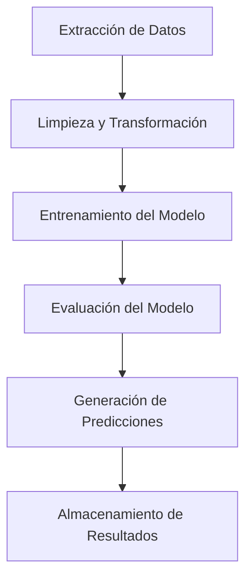

# Documentación de los DAGs en Airflow

Este documento describe el funcionamiento de los DAGs (Directed Acyclic Graphs) utilizados en el proyecto. Los DAGs están diseñados para orquestar y automatizar flujos de trabajo relacionados con el procesamiento de datos y el entrenamiento de modelos.

## Estructura de los DAGs

Los DAGs se encuentran en el directorio `airflow/dags/` y están organizados de la siguiente manera:

- **constants.py**: Contiene constantes y configuraciones globales utilizadas por los DAGs.
- **data_treatment.py**: DAG encargado de realizar el tratamiento de datos.
- **etl_functions.py**: Define las funciones necesarias para los procesos ETL (Extracción, Transformación y Carga).
- **model_functions.py**: Contiene funciones relacionadas con el entrenamiento y evaluación de modelos.
- **model_predictor.py**: DAG responsable de realizar predicciones utilizando modelos entrenados.
- **model_training.py**: DAG encargado de entrenar modelos de machine learning.

## Descripción de los DAGs

### 1. `dag_data_treatment.py`

Este DAG realiza el tratamiento de datos crudos para prepararlos para su uso en los modelos. Incluye tareas como:

- Limpieza de datos.
- Transformaciones necesarias.
- Generación de datasets intermedios.

### 2. `etl_functions.py`

Define las funciones necesarias para los procesos ETL. Estas funciones son utilizadas por otros DAGs para:

- Extraer datos de diversas fuentes.
- Transformar los datos según las necesidades del proyecto.
- Cargar los datos transformados en un destino específico.

### 3. `dag_model_training.py`

Este DAG se encarga de entrenar modelos de machine learning. Incluye tareas como:

- División de datos en conjuntos de entrenamiento y prueba.
- Entrenamiento de modelos utilizando diferentes algoritmos.
- Validación y evaluación de los modelos entrenados.

### 4. `dag_model_predictor.py`

DAG diseñado para realizar predicciones utilizando modelos previamente entrenados. Incluye tareas como:

- Carga de modelos entrenados.
- Generación de predicciones para nuevos datos.
- Almacenamiento de los resultados de las predicciones.

### 5. `model_functions.py`

Contiene funciones auxiliares utilizadas en los DAGs de entrenamiento y predicción de modelos. Estas funciones incluyen:

- Preprocesamiento de datos para modelos.
- Métricas de evaluación.
- Guardado y carga de modelos.

## Diagrama de Flujo del Pipeline

A continuación, se presenta un diagrama de flujo que ilustra el pipeline completo:



## Representación Visual del DAG en Airflow

El siguiente es un ejemplo de cómo se visualiza el DAG en la interfaz de Airflow:


## Diseño para Integrar Futuros Datos y Reentrenar el Modelo

El pipeline está diseñado para ser modular y escalable, permitiendo la integración de nuevos datos. Los pasos clave incluyen:

1. **Integración de Nuevos Datos**:
    - El dag de tratamiento de datos está programado para ejecutarse todos los lunes a las 12:00 PM, incorporando automáticamente nuevos datos desde una fuente predefinida. Como dicha fuente aún no existe se generó el archivo `base_data/new_transactions.parquet` con datos simulados para probar esta funcionalidad. Por lo que todas las semanas el dataset se actualiza con los últimos datos disponibles.

2. **Reentrenamiento del modelo**:
    - Por el momento también está programado para ejecutarse todas las semanas, pero en un entorno productivo podría hacerse cada mayor tiempo
    ya que no es esperable que de un batch de datos a otro haya un cambio significativo en la distribución de los datos.
    - Al estar separado el dag de tratamiento de datos del dag de reentrenamiento, es posible modificar la frecuencia de ejecución de cada uno según las necesidades del proyecto.
    - Para ejecutar el reentrenamiento siempre se debe ejecutar primero el dag de tratamiento de datos, para asegurarse de que el modelo se entrena con los datos más recientes.

3. **Prediccion del modelo**:
    - El dag de predicción puede ejecutarse de forma independiente una vez que el modelo ha sido entrenado y validado.
    - Tambien está programado para ejecutarse semanalmente, pero en un entorno productivo podría hacerse con mayor frecuencia, dependiendo de la necesidad de predicciones en tiempo real o casi real.
    - Al igual que con el reentrenamiento, es importante asegurarse de que el dag de tratamiento de datos se ejecute antes de realizar predicciones para garantizar que se utilicen los datos más recientes, en este caso es especialmente importante ya que si no se podrán hacer predicciones futuras si no se cuenta con los datos de la semana actual.
    - El modelo utilizado para las predicciones será siempre el último modelo entrenado y guardado en el directorio `airflow/dags/models/`.

## Configuración y Ejecución

Para configurar y ejecutar el entorno de Airflow, se utiliza un contenedor Docker basado en la siguiente configuración:

1. **Imagen Base**:

   - Se utiliza la imagen `python:3.10-slim` como base para el contenedor.
2. **Dependencias del Sistema**:

   - Se instalan librerías necesarias como `libgomp1`, `curl`, `libnss3`, entre otras, para garantizar el correcto funcionamiento de Airflow y de las librerias usadas en los dags.
3. **Instalación de Dependencias de Python**:

   - Se actualiza `pip` a la última versión.
   - Se instalan las dependencias listadas en el archivo `requirements.txt`.
4. **Configuración de Airflow**:

   - Se establece el directorio de trabajo en `/root/airflow`.
   - Se configura la variable de entorno `AIRFLOW_HOME` para apuntar al directorio de Airflow.
   - Se deshabilita la carga de ejemplos en Airflow mediante la variable de entorno `AIRFLOW__CORE__LOAD_EXAMPLES=False`.
5. **Inicialización y Configuración**:

   - Se inicializa la base de datos de Airflow con el comando `airflow db migrate`.
   - Se crea un usuario administrador con el siguiente comando:
     ```bash
     airflow users create --role Admin --username admin --email admin \
     --firstname admin --lastname admin --password admin
     ```
6. **Estructura de Archivos**:

   - Se copian las carpetas necesarias al contenedor:
     - `dags` para los flujos de trabajo.
     - `logs` para los registros de ejecución.
     - `plugins` para extensiones personalizadas.
     - `base_data` para datos base. En está carpeta deben estar los archivos de datos.
7. **Ejecución**:

   - El contenedor expone el puerto `8080` para acceder a la interfaz web de Airflow.
   - Se utiliza el comando `airflow standalone` para iniciar el servidor web y el scheduler.

### Pasos para Ejecutar el Contenedor

1. Crear el archivo simulado de nuevos datos:

    Como no existen datos nuevos para probar la integración de nuevos datos, se creó un jupyter notebook `data_simulation/new_transaction_generator.ipynb` que genera un archivo simulado en `base_data/new_transactions.parquet`. Asegúrate de ejecutar este notebook para crear el archivo antes de ejecutar el contenedor.

2. Construir la imagen Docker:

   ```bash
   docker build -t airflow_project .
   ```
3. Ejecutar el contenedor:

   ```bash
   docker run -p 8080:8080 airflow_project
   ```
4. Acceder a la interfaz web de Airflow:

   - URL: [http://localhost:8080](http://localhost:8080)
   - Credenciales:
     - Usuario: `admin`
     - Contraseña: `admin`

## Logs

Los logs generados por los DAGs se almacenan en el directorio `airflow/logs/`. Estos logs son útiles para depurar errores y monitorear la ejecución de las tareas.

## Conclusión

Esta documentación proporciona una visión general del funcionamiento de los DAGs en el proyecto. Para más detalles, consulta los archivos fuente en el directorio `airflow/dags/` o la interfaz web de Airflow.
